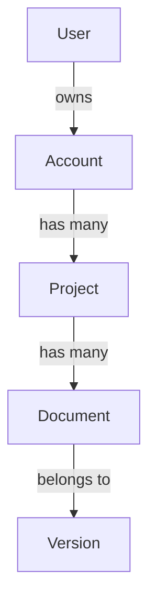

# AI_CONTEXT.md

> The "what you need to know to be useful here" file. Read on every session.

---

## 1. Mission (one paragraph)

_{What this product does, for whom, why it should exist.}_

## 2. Glossary

| Term | Definition |
|------|------------|
| {term} | {definition} |

> Add every project-specific term as it comes up. Future-you will thank present-you.

## 3. Stakeholders

| Role | Person | What they care about |
|------|--------|----------------------|
| Product owner | | |
| Eng lead | | |
| Designer | | |
| Customer-facing lead | | |
| Compliance owner | | |

## 4. Constraints

| Type | Constraint | Why |
|------|------------|-----|
| Regulatory | e.g., SOC 2 by Q3 | Customer contracts |
| Performance | e.g., p95 < 200ms | UX requirement |
| Budget | e.g., infra < $5k/mo | Pre-Series A |
| Team | e.g., 2 engineers | Headcount |
| Time | e.g., MVP by YYYY-MM-DD | Investor demo |

## 5. Conventions Specific to This Project

_(Overrides or specializations of workspace defaults — link rather than duplicate.)_

- _(example) All money values stored as integer cents, never floats._
- _(example) Tenant ID is required in every query — enforced by middleware in `src/middleware/tenant.ts`._
- _(example) Webhook handlers must be idempotent by `event.id`._

## 6. Domain Model — High Level

> Replace with your real model. Keep this diagram in sync with `docs/database/DATABASE_SCHEMA.md`.

## 7. Critical User Journeys

1. **{Journey 1}** — `<src/path>` is the entry point; `<test/path>` is the e2e test.
2. **{Journey 2}** — ...

> When refactoring, these journeys must not regress.

## 8. Integrations

| Vendor | What it does | Where the integration lives | Failure mode |
|--------|--------------|-----------------------------|--------------|
| Stripe | Billing | `src/billing/` | Webhook retries + idempotency |
| SendGrid | Email | `src/notifications/email/` | Falls back to log + alert |
| ... | | | |

## 9. Known Hot-Spots

> Files/modules that are touched often, are complex, or are fragile. Refactor before adding to them.

| Path | Why it's hot | Mitigation |
|------|--------------|------------|
| | | |

## 10. Out-of-Scope (Explicit Non-Goals)

> List things people will ask for that this project will NOT do, and why.

- _(example) We will not support BYOK encryption in v1 — Pro tier only in v2._
- _(example) Mobile apps are out of scope; PWA only._

---

*Update frequency: whenever a new stakeholder, constraint, integration, or convention appears.*
