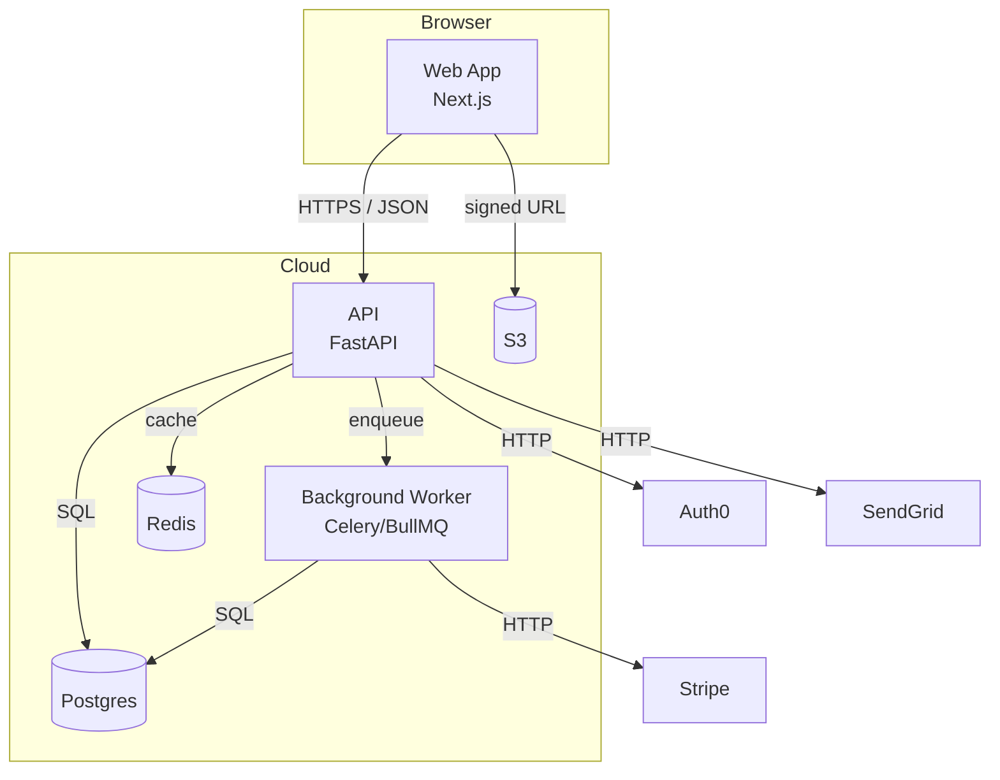
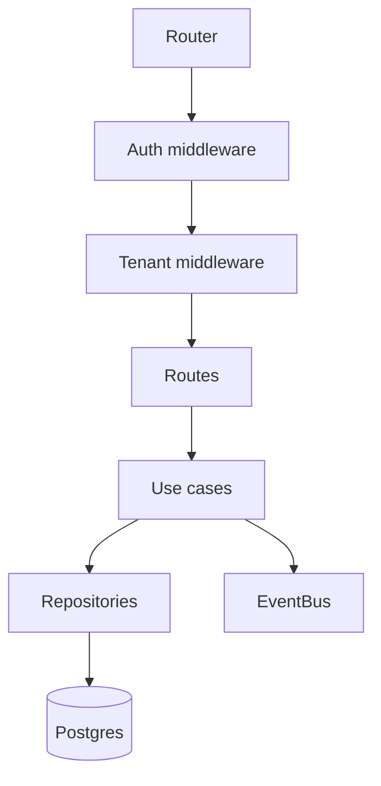

# SYSTEM_ARCHITECTURE.md

> What runs where, how it talks, and why. C4 model (Context → Container → Component → Code).

---

## 1. Context Diagram (Level 1)

```mermaid
graph LR
  User((User))
  Admin((Admin))
  System[{PROJECT_NAME}]
  Stripe[Stripe]
  SendGrid[SendGrid]
  Auth0[Auth0]

  User --> System
  Admin --> System
  System --> Stripe
  System --> SendGrid
  System --> Auth0
```

| External actor / system | Purpose |
|--------------------------|---------|
| User | End customer |
| Admin | Internal operator |
| Stripe | Billing |
| SendGrid | Transactional email |
| Auth0 | Identity |

## 2. Container Diagram (Level 2)



| Container | Tech | Deploys to | Owner |
|-----------|------|------------|-------|
| Web App | Next.js 15 | Vercel | |
| API | FastAPI | Fly.io | |
| Worker | Celery | Fly.io | |
| Postgres | RDS / Neon | AWS | |
| Redis | Upstash | | |
| Object storage | S3 | AWS | |

## 3. Component Diagrams (Level 3)

> One section per non-trivial container. Add as the system grows.

### 3.1 API components



## 4. Cross-Cutting Concerns

| Concern | Where it lives | Notes |
|---------|----------------|-------|
| Auth | `src/auth/`, middleware | Auth0 → JWT → request.user |
| Authz | `src/authz/policies/` | RBAC + tenant scoping |
| Logging | `src/observability/logger.ts` | Pino → JSON → Vector → Loki |
| Tracing | `src/observability/tracing.ts` | OpenTelemetry → Honeycomb |
| Metrics | `src/observability/metrics.ts` | Prometheus → Grafana |
| Errors | `src/errors/` | Typed errors → Sentry |
| Config | `src/config/` | env → Zod validated |
| Feature flags | `src/features/` | GrowthBook |

## 5. Request Path (happy path)

```
Browser
  → CDN (Vercel)
    → Web App (Next.js, edge)
      → API (Fly.io, region nearest user)
        → AuthMW (verify JWT)
          → TenantMW (resolve tenant)
            → Route handler
              → Use case
                → Repository → DB
              → Returns DTO
            → Response (JSON)
          → Response
        → Response
      → Render
    → CDN cache (if applicable)
  → Browser
```

## 6. Failure Modes

| Failure | Detection | Mitigation |
|---------|-----------|------------|
| DB down | Healthcheck + Sentry | Circuit breaker → 503 → status page |
| Stripe outage | Webhook timeout | Queue + retry with backoff |
| Email send failure | Sentry | Retry 3× → mark for ops review |
| Cache miss storm | Metrics on origin RPS | Request coalescing |

## 7. Capacity & Scale

| Resource | Current | Headroom | Scale strategy |
|----------|---------|----------|----------------|
| API requests | {RPS} | 10× | Horizontal autoscale |
| DB | {conns} | 5× | Read replicas + PgBouncer |
| Worker queue | {jobs/min} | 5× | Partition by tenant |
| Object storage | {GB/mo} | unbounded | Lifecycle to glacier |

## 8. Security Posture

- TLS everywhere (cert via Caddy / ACM)
- Secrets via {SECRET_MANAGER}
- WAF at edge (Cloudflare / Vercel firewall)
- Least-privilege IAM per service
- See `docs/security/THREAT_MODEL.md`

## 9. Data Flows

| Flow | Source → Destination | Format | Frequency |
|------|----------------------|--------|-----------|
| Audit log | API → S3 | NDJSON | Real-time |
| Analytics | All → PostHog | JSON | Real-time |
| Backups | DB → S3 (encrypted) | pg_dump.gz | Hourly |
| Reports | DB → S3 → BI tool | Parquet | Daily |

## 10. Open Architecture Questions

- _{example} Migrate from REST to gRPC for internal calls?_
- _{example} Adopt event-sourcing for billing?_

---

*Update frequency: when adding/removing a container, OR on every cross-cutting change.*
*Diagrams live in `docs/architecture/diagrams/`; this file embeds the most current versions.*
