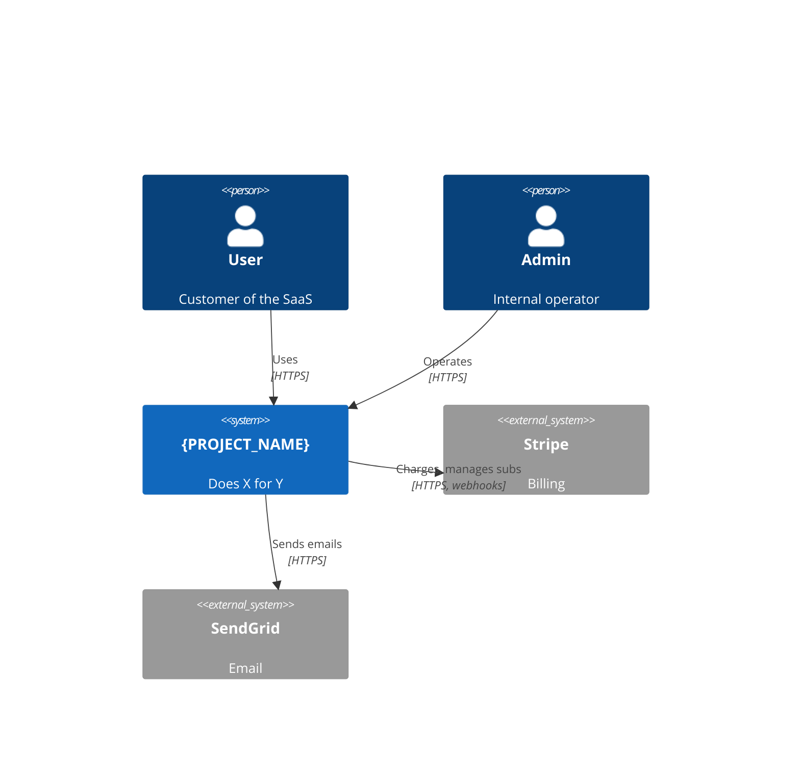

# SYSTEM_ARCHITECTURE.md (canonical)

> The single source of truth for system architecture. The version under `ai/context/` is the AI-optimized summary; this is the long form.

Use the [C4 model](https://c4model.com/): Context → Container → Component → Code.

---

## 1. System Context

## 2. Container Diagram

See `ai/context/SYSTEM_ARCHITECTURE.md` §2.

## 3. Component Diagrams

One section per non-trivial container. Embed Mermaid; large source diagrams under `docs/architecture/diagrams/`.

## 4. Key Sequence Diagrams

| Flow | File |
|------|------|
| Signup → onboarded | `diagrams/seq-signup.md` |
| Purchase → fulfillment | `diagrams/seq-purchase.md` |
| Webhook receipt | `diagrams/seq-webhook.md` |

## 5. Architectural Style

| Aspect | Choice | ADR |
|--------|--------|-----|
| Topology | Modular monolith → carve out services as scale demands | ADR-0004 |
| Communication | Sync HTTPS for user-facing, async events for cross-service | ADR-0005 |
| Storage | One Postgres per logical bounded context | ADR-0006 |
| Multi-tenancy | Shared DB, tenant_id discriminator with RLS | ADR-0007 |
| Identity | OIDC via Auth0 | ADR-0008 |

## 6. Quality Attributes

| Attribute | Target | Verified by |
|-----------|--------|-------------|
| Availability | 99.9% monthly | Pingdom + status page |
| p95 latency | 300ms | k6 in CI, Honeycomb in prod |
| RTO | 1h | DR drill annually |
| RPO | 5 min | Backup interval |
| Tenant isolation | strict | RLS + integration test |

## 7. Tech Inventory

See `docs/THIRD_PARTY_SERVICES.md`.

## 8. Open Architecture Questions

Maintained as ADR-proposals. List those in `Proposed` status.
