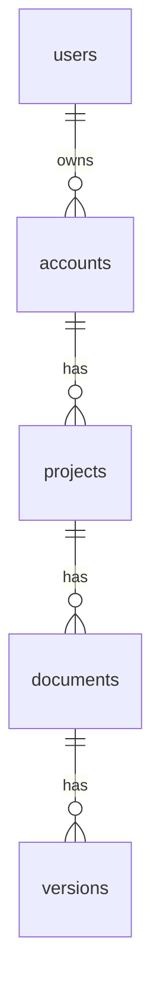

# DATABASE_SCHEMA.md

> Canonical schema reference. Generated diagrams under `docs/database/diagrams/`. Migration files under `database/migrations/`.

---

## Conventions

- Snake_case table names, plural (`users`, `orders`).
- Snake_case column names, singular (`first_name`).
- All tables have: `id` (UUID v7), `created_at`, `updated_at`, `deleted_at` (nullable, for soft delete).
- All foreign keys explicit; named `{referenced_table}_id`.
- All FKs indexed.
- Money stored as `BIGINT` cents.
- Time stored as `TIMESTAMPTZ` (UTC).
- Booleans named affirmatively (`is_active`, not `is_inactive`).
- Indexes named: `idx_{table}_{cols}`; unique: `uniq_{table}_{cols}`.

## ERD

## Tables

### users
| Column | Type | Constraints | Notes |
|--------|------|-------------|-------|
| id | UUID | PK | v7 |
| email | TEXT | UNIQUE NOT NULL | citext |
| name | TEXT | | |
| created_at | TIMESTAMPTZ | NOT NULL DEFAULT now() | |
| updated_at | TIMESTAMPTZ | NOT NULL DEFAULT now() | |
| deleted_at | TIMESTAMPTZ | | soft delete |

Indexes:
- `uniq_users_email` (email)

### accounts
| Column | Type | Constraints |
|--------|------|-------------|
| id | UUID | PK |
| owner_user_id | UUID | FK users(id) NOT NULL |
| name | TEXT | NOT NULL |
| plan | TEXT | NOT NULL DEFAULT 'free' |
| ... | | |

Indexes:
- `idx_accounts_owner_user_id`

> Add one section per table.

## Migration Rules

1. **Forward-only.** No down-migrations in prod path.
2. **Two-step destructive changes.** Drop column = (a) stop writing → ship; (b) drop after one release.
3. **Backfills offline.** Never block deploys on row-by-row backfills.
4. **Always indexed before queried.** Add index, deploy, then enable query path.
5. **Tested against prod-sized data** in staging before prod.

## Performance Notes

- `users.email` has unique index → use for login lookup.
- `accounts.owner_user_id` indexed → safe for `WHERE owner_user_id = ?`.
- Aggregations on `documents` should hit the materialized view `mv_document_stats`.

## Backup Policy

See `docs/database/BACKUP_POLICY.md`.
