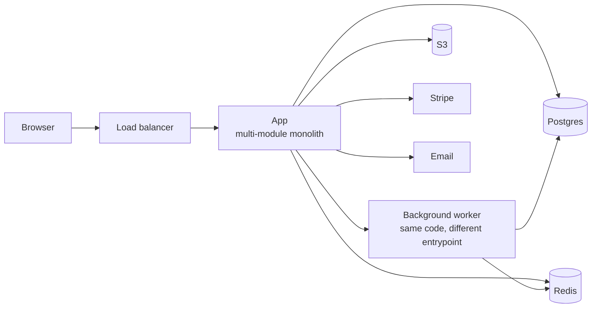

# MODULAR_MONOLITH.md

> Default. Pick this unless you have a *concrete* reason to pick something else.

## When this fits
- 1–10 engineers
- One product line
- Sync-friendly latency budgets
- No regulatory data-isolation forcing separate services
- Pre-product-market-fit OR early post-PMF

## When it doesn't
- Independent scaling needs across modules
- Strict team ownership boundaries that ship at different cadences
- Polyglot stacks justified by genuinely different workloads

## Container diagram



## Module boundaries (logical, not physical)

```
src/
├── auth/           # nobody else imports from auth/internal
├── billing/
├── projects/
├── notifications/
├── shared/         # truly cross-cutting only
└── platform/       # logger, config, observability
```

Enforce with lint (e.g., `eslint-plugin-boundaries`, Nx project rules, Ruff `tidy-imports`).

## Critical paths + latency budgets

| Path | p95 budget | Notes |
|------|-----------|-------|
| Auth → home | 400ms | includes DB read |
| API list endpoint | 200ms | cursor paginated |
| API write endpoint | 300ms | single-row write |
| Background job | n/a (latency irrelevant) | throughput matters |

## Failure modes

| Failure | Effect | Recovery |
|---------|--------|----------|
| DB outage | Total | RDS multi-AZ failover ~30s |
| Cache outage | Slow but works | Origin fallback |
| Background worker down | Job backlog grows | Replay queue on recovery |
| One module misbehaves | Can affect entire app | Bulkhead in code (timeouts, circuit breakers per module) |

## Cost shape
- Single deployable, single DB, single cache — minimum infra cost
- Scales vertically first, horizontally after autoscaling tuned
- Observability cost grows with traffic, not service count

## Evolution path
- Module boundaries clean → carve out a service ONLY when:
  - Independent scale needed
  - Independent deploy cadence essential
  - Polyglot stack justified
- Carve in this order: notifications → search → billing webhooks → ...
- Stop when the pain is gone, not when "everyone does microservices"

## References
- Shopify modular monolith
- Basecamp HEY (Rails majestic monolith)
