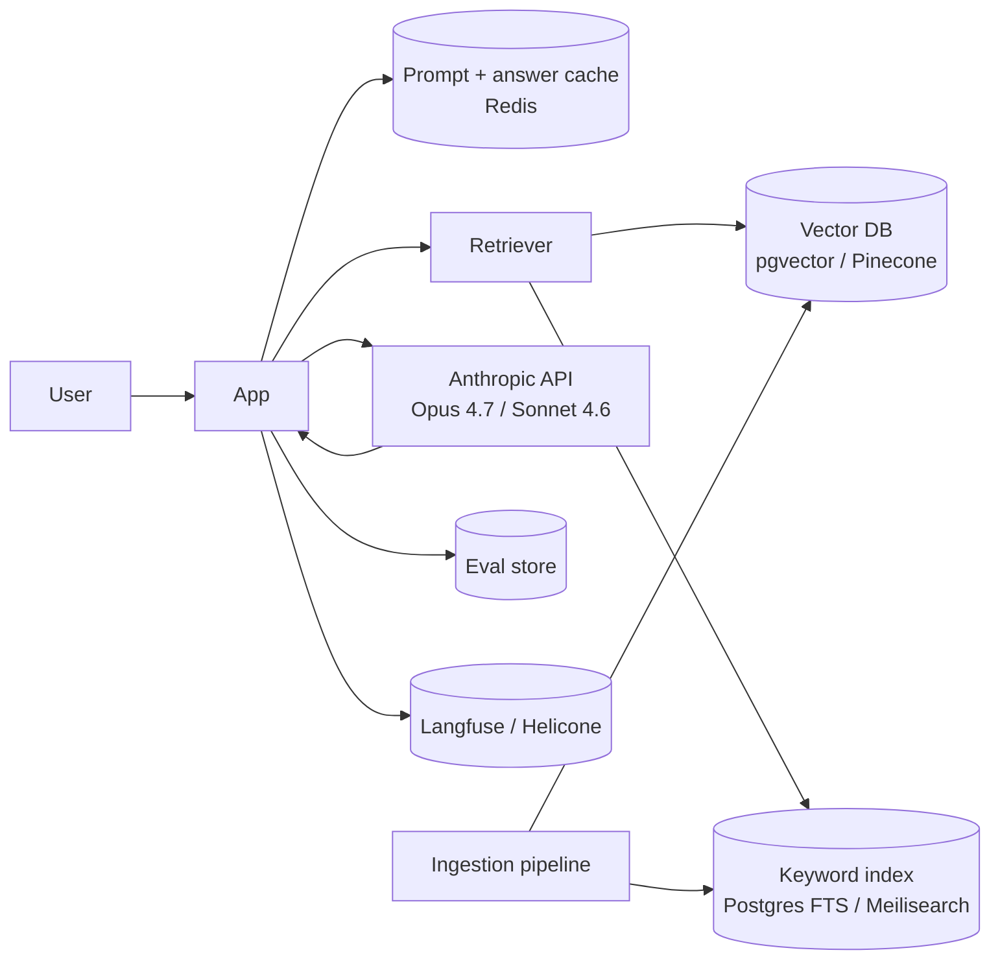

# RAG_LLM_APP.md

> Reference architecture for retrieval-augmented LLM apps using Claude.

## When this fits
- Domain knowledge sits outside the model weights
- Answers must cite sources
- Knowledge base changes faster than model retraining
- Latency budget allows a retrieval hop (≥800ms)

## When it doesn't
- General-purpose chat with no proprietary corpus (just call the model)
- Sub-300ms latency requirement (consider fine-tune)
- Mostly numerical / structured queries (use SQL, not vector search)

## Container diagram



## Critical paths

| Path | p95 budget | Notes |
|------|------------|-------|
| Question → answer | 2.5s | includes retrieval + model + stream-to-first-token |
| Retrieval | 200ms | vector + keyword fanout, then rerank |
| Model first token | 600ms | with prompt caching warm |
| Model full answer | 1.5s | streamed |

## Mandatory components

- **Prompt caching** on system prompt + retrieved chunks
- **Citation block** in every answer; UI links to sources
- **Hallucination guard:** answer schema requires `sources[]` non-empty when domain-specific
- **Eval set:** at least 50 golden examples; CI blocks if regression >2%
- **Cost dashboard:** per-feature attribution, per-tenant guardrail
- **Fallback chain:** primary model → cheaper model → cached answer → safe refusal
- **Prompt injection isolation:** user text inside explicit `<user_query>` delimiters; system instructions never mix
- **Rate limit per tenant:** quotas + 429s

## Ingestion pipeline

```
Source → fetch → clean → chunk (semantic, ~500 tokens) → embed → upsert (vector + keyword + metadata)
```

- Idempotent
- Versioned (re-embed on model upgrade)
- Track per-chunk: source, position, last-updated, access policy

## Retrieval

- Hybrid: vector + keyword + rerank
- Rerank with a small model (e.g., Cohere Rerank or a local cross-encoder)
- Per-tenant filter pushed down to the index, not applied post-fetch

## Safety

- Output classifier on responses before returning to user (Claude is the default classifier for the same call's reasoning)
- Profanity / PII / unsafe-content gating per policy
- Audit log: every (prompt, model, tokens, cost, latency, cache, user, tenant)

## Cost levers
- Prompt cache hit rate (target >70% on system prompt)
- Cheaper-model fallbacks for non-critical paths
- Truncate context to budget; don't pad
- Embedding cache for repeat queries
